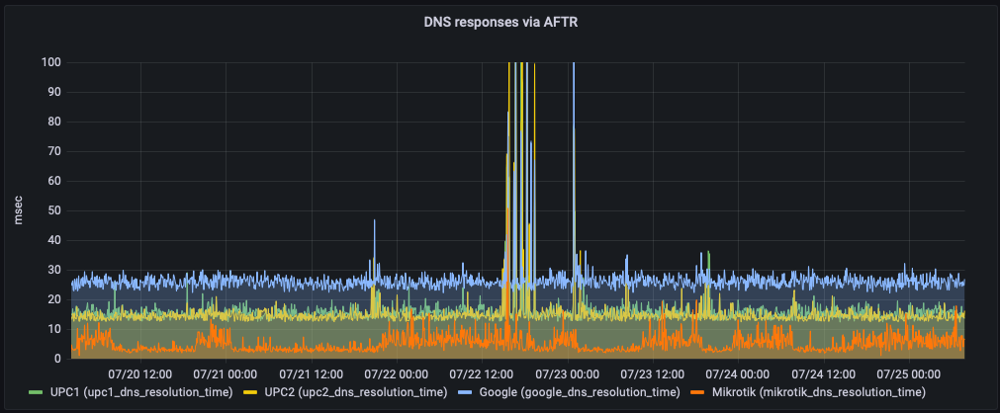
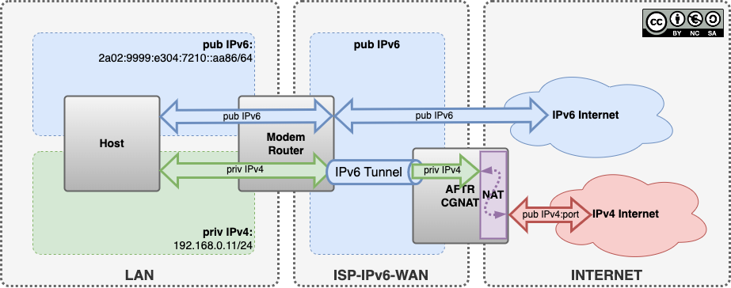

# W.I.P

- [W.I.P](#wip)
- [IPv6-home](#ipv6-home)
- [IPv6 address space](#ipv6-address-space)
- [Scope](#scope)
- [#IPv6 #Mikrotik](#ipv6-mikrotik)
  - [IPv6 DHCPv6 Client Mikrotik](#ipv6-dhcpv6-client-mikrotik)
- [#IPv6 #Mikrotik upstream #DNSv6](#ipv6-mikrotik-upstream-dnsv6)
- [IPv6 DNSv6](#ipv6-dnsv6)
    - [#Magenta-DNSv6](#magenta-dnsv6)
    - [#Google-DNSv6](#google-dnsv6)
    - [#AdGuard-DNSv6](#adguard-dnsv6)
- [#IPv6 #Mikrotik SOL/RA](#ipv6-mikrotik-solra)
  - [Stateless RA + RADVD/RDNSS -> works](#stateless-ra--radvdrdnss---works)
  - [RA + RADVD -> better fit to assign local DNSv6 ULA address](#ra--radvd---better-fit-to-assign-local-dnsv6-ula-address)
- [#IPv6 #DHCPv6](#ipv6-dhcpv6)
  - [Stateful vs Stateless DHCPv6](#stateful-vs-stateless-dhcpv6)
  - [Stateless -> RA + DHCPv6 options only (DNS/domain but exkl. addresses)](#stateless---ra--dhcpv6-options-only-dnsdomain-but-exkl-addresses)
  - [Stateful -> RA + DHCPv6 adress handout (not used)](#stateful---ra--dhcpv6-adress-handout-not-used)
- [ICMPv6 Types and Codes](#icmpv6-types-and-codes)
- [IPv6 DS-Lite / AFTR](#ipv6-ds-lite--aftr)
  - [#Magenta #DS-Lite-FQDN](#magenta-ds-lite-fqdn)
  - [#Magenta #DS-Lite-address](#magenta-ds-lite-address)
- [#IPv6 #ULA ( Unique Local Address ) Generation -> #RFC4193](#ipv6-ula--unique-local-address--generation---rfc4193)
  - [ULA / RFC4193 generators](#ula--rfc4193-generators)
  - [ULA Network EXAMPLE](#ula-network-example)
    - [splitting per vlan](#splitting-per-vlan)
      - [vlan10](#vlan10)
      - [vlan20](#vlan20)
      - [vlan30](#vlan30)
      - [/48 into /52 splits](#48-into-52-splits)
      - [/52 into /64 splits](#52-into-64-splits)


# IPv6-home
IPv6 home network best practice

# IPv6 address space

- `fe80::/10` LLA (link-local addresses), reserved for IP address autoconfiguration
- `fd00::/8` ULA (unique local addresses) local space, RFC4193 local, non-routable IP addresses [https://en.wikipedia.org/wiki/Unique_local_address] [https://cd34.com/rfc4193/]
- `2000::/3`  public IPv6 addresses (`2a02:8388::/29` -> UPC AT)


# Scope

-  dedicated ULA /47 local subnet(s), per vlan a /52 in order to do another /64 PD (if needed) and assigned as EUI-64 to local clients
-  local caching DNSv6 with static AAAA for local EUI-64 ULA assignments (shall be considered as fixed IPv6)
-  local caching DNSv6 talking to ISP IPv6/DNSv6 only, as ISP DNSv4 request via DS-LITE/AFTR/CGNAT have s very high latency (~50-200msec). DNSv4 via AFTR is often mistakenly mitigated at any DDOS, so it becomes randomly unresponsive for couple of minutes (-> ISP to blame). Requests via DNSv4 on local side to Mikrotik router working, but uplink DNS request being made via IPv6/DNSv6 (ensure lowest possible latency via native DNSv6)
-  mikrotik bridge is getting prefix and single IPv6 as DHCPv6 client from ISP modem, IPv6 adress is used for DNSv6 queries and IPv6 /60 prefix used for further RA/DHCPv6 to clients behind the bridge
-  bridged firewall is blocking SOL/RA/DHCPv6 between ISP modem and clients, to enforce the mikrotik router as SPOC for SOL/RA/DHCPv6 for the clients and to exclusivly provide DNSv6 ULA adresses via RDNSS and stateless DHCPv6


```

                                        ▲
                                        │
  ┌───────────────────────┐             │
  │                       │             │
  │        Modem          │             │
  │                       │             │ IPv6
  └──────────┬────────────┘             │ Pub DNSv6
             │                          │
             │                          │
  ┌──────────▼────────────┐     ┌───────┴────────┐
  │                       │     │                │
  │       Mikrotik        │     │      DNS       │
  │       (bridge)        │     │                │
  └──────────┬────────────┘     └───▲───────▲────┘
             │                      │       │
             │                      │       │
  ┌──────────▼────────────┐         │       │
  │                       │         │ IPv4  │ IPv6
  │         LAN           │         │ priv  │ ULA
  │                       │         │       │
  ├───────────┬───────────┤         │       │
  │   Vlan-1  │ Vlan-n    │
  └───────────┴───────────┘


```


# #IPv6 #Mikrotik


## IPv6 DHCPv6 Client Mikrotik 

Enable IPv6 DHCP Client to get public IPv6 Address from ISP for Mikrotik and Prefix to be used as pool to assign public IPv6 to devices in LAN/Bridge behind router.


IPv6 -> DHCPv6 Client

```
Interface: bridge
Request: [ ] info,  [x] address , [x] prefix
Pool Name : isp-dhcpv6-pd
Pool Prefix Length: 64

[ ] Use Peer DNS
[x] Use Interface DUID
[ ] Rapid Commit
[x] Add Default Route
```

# #IPv6 #Mikrotik upstream #DNSv6

In order to achieve lowest possible latency for DNS queries, it is recomended to use DNSv6 instead of DNSv4 that goes via AFTR and CGNAT that adds almost 3 times latency!

In a normal ISP provided product this magic is done on the modem itself, so the modem should do upstream DNSv6 queries even for IPv4 only clients.

Flow: Client -> DNSv4 -> Modem(192.168.0.1) -> DNSv6 -> ISP-DNSv6-Server

So the worst one can do, is to set a IPv4 DNSv4 server like 8.8.8.8, then every query will go via AFTR and the queries will take up to 3 times longer, not fair to blame the ISP.

Below a real world statistics of measurements for DNSv4 queries via AFTR vs. direct DNSv6 upstrem from a mikrotik router.

The ISP DNSv4 (UPC1/UPC2) via AFTR is slow, even if its in the same datacenter as the cable modem termination system, and as a suprise Google DNSv4 is slow as hell.

Overall recommendation is to use your ISP DNS servers, they're faster by design (should be), also ISP's are not interested in DNS queries which is better for privacy. In the end its a matter of trust, who should be able to see personal data (DNS queries), a service provider that buinissmodel is all about data collecting-processing-selling or an ISP which businessmodel is internet access.
Also one should care about the hype around DoH, it adds an enormous amount of overhead and latency and in the end (after encryption) a DNS resolver does see the real queries!




For DNSv6 upstream IPv6 connectivity should be in place -> mikrotik must have a public IPv6 address assigned -> IPv6 DHCPv6 Client enabled and working


IP -> DNS 

```
Servers:
2a02:8383:d:c::1
2a02:8383:d:c::1000
```

Add IPv6 addresses only, the mikrotik will use DNSv6 for upstream (the router has no other choice)

Ensure the clients are getting the router IPv4 Adress as DNSv4 server via DHCPv4.


# IPv6 DNSv6

### #Magenta-DNSv6

```
2a02:8383:d:c::1
2a02:8383:d:c::1000
```

### #Google-DNSv6

```
2001:4860:4860::8888
2001:4860:4860::8844
```

### #AdGuard-DNSv6

```
2a00:5a60::ad1:0ff
2a00:5a60::ad2:0ff
```


# #IPv6 #Mikrotik SOL/RA


## Stateless RA + RADVD/RDNSS -> works

IPv6 -> ND -> bridge
```
Interface: bridge
RA Interval: 20-60
RA Delay: 3
RA Preference: medium

RA Lifetime: 1800
Hop Limit: 64
DNS Servers: fd9f:9999:48f6::1 (your defined ULA address on the mikrotik)

[x] Advertise MAC Address
[x] Advertise DNS
[ ] Managed Adress Information
[x] Other Configuration
```

In case IPv6 RA is wanted in specific device only, disable it the others and in `all`

IPv6 -> ND -> all
```
Interface: all
RA Interval: 200-600
RA Delay: 3
RA Preference: medium

RA Lifetime: 1800

[ ] Advertise MAC Address
[ ] Advertise DNS
[ ] Managed Adress Information
[ ] Other Configuration
```


##  RA + RADVD -> better fit to assign local DNSv6 ULA address

RDNSS (RFC6101)

```
/ipv6 nd set advertise-dns=yes 
```


# #IPv6 #DHCPv6 

Clients listen for DHCP messages on UDP port 546. Servers and relay agents listen for DHCP messages on UDP port 547.

Doesn't satisfy all scopes, clients didn't get DNSv6 for some reason.

## Stateful vs Stateless DHCPv6

A stateless DHCPv6 server does not provide IPv6 addresses at all. It only provides "other information" such as a DNS server list and a domain name. It works in conjunction with another feature called SLAAC that tells hosts how to generate global unicast addresses. In this context stateless means that no server keeps track of what addresses have been assigned by which hosts and what addresses are still available for an assignment.

A stateful DHCPv6 server provides IPv6 addresses and "other information" to hosts. It also keeps track of the state of each assignment. It tracks the address pool availability and resolves duplicated address conflicts. It also logs every assignment and keeps track of the expiration times. However, there is a big difference between DHCPv6 and DHCPv4. In IPv4 DHCP server typically provides default gateway addresses to hosts. In IPv6, only routers sending Router Advertisement messages can provide a default gateway address dynamically. 


## Stateless -> RA + DHCPv6 options only (DNS/domain but exkl. addresses)

IPv6 -> ND -> `<device>` -> [x] Other Configuration

```
/ipv6 nd set other-configuration=yes
```

## Stateful -> RA + DHCPv6 adress handout (not used)

IPv6 -> ND -> `<device>` -> [x] Managed Adress Information 

```
/ipv6 nd set managed-adress-configuration=yes
```


# ICMPv6 Types and Codes


| Type | Code	| Description					|
| ---- | -------| ------------------------------| 
| 128  | 0		| echo request					|	
| 129  | 0		| echo reply					|
| 130  | 0		| group membership query		|
| 131  | 0		| group membership reply		|
| 132  | 0		| group membership reduction	|
| 133  | 0		| router solicitation			|
| 134  | 0		| router advertisement			|
| 135  | 0		| neighbor solicitation			|	
| 136  | 0		| neighbor advertisement		|	
| 137  | 0		| redirect						|	


# IPv6 DS-Lite / AFTR

DS-Lite is a method to provide IPv4 connectivity via a IPv6 uplink - a IPv6 point-to-point tunnel to AFTR (Address Family Transition Router) where the local IPv4 traffic is routed to ISP central CGNAT to be nat'ed into public IPv4.




## #Magenta #DS-Lite-FQDN

```
aftr02.net.magenta.at
```

## #Magenta #DS-Lite-address

```
2a02:8386::afff
```


# #IPv6 #ULA ( Unique Local Address ) Generation -> #RFC4193

https://en.wikipedia.org/wiki/Unique_local_address

ULA (unique local addresses) `fd00::/8` a local private IPv6 space (RFC4193), non-routable IP addresses to be used in home network.


## ULA / RFC4193 generators

https://cd34.com/rfc4193/

https://network00.com/NetworkTools/IPv6LocalAddressRangeGenerator/

https://rovaughn.com/ipv6-subnet-generator/


## ULA Network EXAMPLE

Your Private IPv6 network is:

`fd9f:9999:48f6::/48`

giving you access to the to the following /64s:

`fd9f:9999:48f6:0::/64` through `fd9f:9999:48f6:ffff::/64`


```
sipcalc fd9f:9999:48f6::/48 --v6split=64 | grep -c Network
65536
```

First `fd9f:9999:48f6:0::/64` prefix shall be reserved for EUI64


### splitting per vlan

`fd9f:9999:48f6::/48` -> `::/52` -> 15 subnets

```shell
nean@init ~ $ sipcalc fd9f:9999:48f6::/48 --v6split=52 | grep -c Network
16
```


`::/52` into `/64` -> 4096 subnets

```shell
nean@init ~ $ sipcalc fd9f:9999:48f6::/52 --v6split=64 | grep -c Network
4096
```


#### vlan10

`fd9f:9999:48f6::/52`

```shell
sipcalc fd9f:9999:48f6::/52
-[ipv6 : fd9f:9999:48f6::/52] - 0

[IPV6 INFO]
Expanded Address	- fd9f:9999:48f6:0000:0000:0000:0000:0000
Compressed address	- fd9f:9999:48f6::
Subnet prefix (masked)	- fd9f:9999:48f6:0:0:0:0:0/52
Address ID (masked)	- 0:0:0:0:0:0:0:0/52
Prefix address		- ffff:ffff:ffff:f000:0:0:0:0
Prefix length		- 52
Address type		- Unassigned
Network range		- fd9f:9999:48f6:0000:0000:0000:0000:0000 -
			  fd9f:9999:48f6:0fff:ffff:ffff:ffff:ffff
```


#### vlan20

`fd9f:9999:48f6:2000::/52`

```shell
nean@init ~ $ sipcalc fd9f:9999:48f6:2000::/52
-[ipv6 : fd9f:9999:48f6:2000::/52] - 0

[IPV6 INFO]
Expanded Address	- fd9f:9999:48f6:2000:0000:0000:0000:0000
Compressed address	- fd9f:9999:48f6:2000::
Subnet prefix (masked)	- fd9f:9999:48f6:2000:0:0:0:0/52
Address ID (masked)	- 0:0:0:0:0:0:0:0/52
Prefix address		- ffff:ffff:ffff:f000:0:0:0:0
Prefix length		- 52
Address type		- Unassigned
Network range		- fd9f:9999:48f6:2000:0000:0000:0000:0000 -
			  fd9f:9999:48f6:2fff:ffff:ffff:ffff:ffff
```


#### vlan30

`fd9f:9999:48f6:3000::/52`

```shell
sipcalc fd9f:9999:48f6:3000::/52
-[ipv6 : fd9f:9999:48f6:3000::/52] - 0

[IPV6 INFO]
Expanded Address	- fd9f:9999:48f6:3000:0000:0000:0000:0000
Compressed address	- fd9f:9999:48f6:3000::
Subnet prefix (masked)	- fd9f:9999:48f6:3000:0:0:0:0/52
Address ID (masked)	- 0:0:0:0:0:0:0:0/52
Prefix address		- ffff:ffff:ffff:f000:0:0:0:0
Prefix length		- 52
Address type		- Unassigned
Network range		- fd9f:9999:48f6:3000:0000:0000:0000:0000 -
			  fd9f:9999:48f6:3fff:ffff:ffff:ffff:ffff
```

...

#### /48 into /52 splits

```shell
nean@init ~ $ sipcalc fd9f:9999:48f6::/48 --v6split=52 | head -n 20
-[ipv6 : fd9f:9999:48f6::/48] - 0

[Split network]
Network			- fd9f:9999:48f6:0000:0000:0000:0000:0000 -
			  fd9f:9999:48f6:0fff:ffff:ffff:ffff:ffff
Network			- fd9f:9999:48f6:1000:0000:0000:0000:0000 -
			  fd9f:9999:48f6:1fff:ffff:ffff:ffff:ffff
Network			- fd9f:9999:48f6:2000:0000:0000:0000:0000 -
			  fd9f:9999:48f6:2fff:ffff:ffff:ffff:ffff
Network			- fd9f:9999:48f6:3000:0000:0000:0000:0000 -
			  fd9f:9999:48f6:3fff:ffff:ffff:ffff:ffff
Network			- fd9f:9999:48f6:4000:0000:0000:0000:0000 -
			  fd9f:9999:48f6:4fff:ffff:ffff:ffff:ffff
Network			- fd9f:9999:48f6:5000:0000:0000:0000:0000 -
			  fd9f:9999:48f6:5fff:ffff:ffff:ffff:ffff
Network			- fd9f:9999:48f6:6000:0000:0000:0000:0000 -
			  fd9f:9999:48f6:6fff:ffff:ffff:ffff:ffff
Network			- fd9f:9999:48f6:7000:0000:0000:0000:0000 -
			  fd9f:9999:48f6:7fff:ffff:ffff:ffff:ffff
Network			- fd9f:9999:48f6:8000:0000:0000:0000:0000 -
```

#### /52 into /64 splits

```shell
nean@init ~ $ sipcalc fd9f:9999:48f6::/52 --v6split=64 | head -n 10
-[ipv6 : fd9f:9999:48f6::/52] - 0

[Split network]
Network			- fd9f:9999:48f6:0000:0000:0000:0000:0000 -
			  fd9f:9999:48f6:0000:ffff:ffff:ffff:ffff
Network			- fd9f:9999:48f6:0001:0000:0000:0000:0000 -
			  fd9f:9999:48f6:0001:ffff:ffff:ffff:ffff
Network			- fd9f:9999:48f6:0002:0000:0000:0000:0000 -
			  fd9f:9999:48f6:0002:ffff:ffff:ffff:ffff
Network			- fd9f:9999:48f6:0003:0000:0000:0000:0000 -
```

